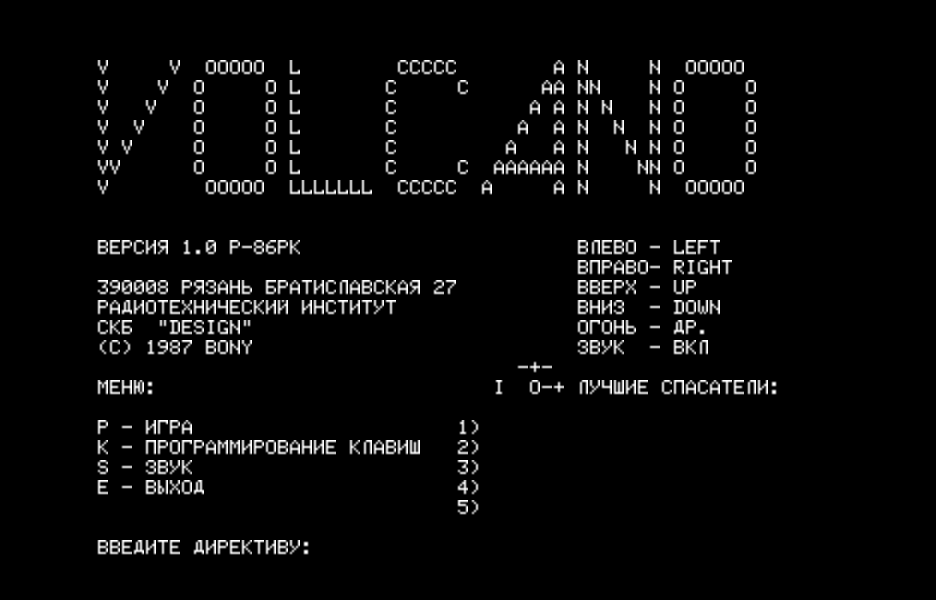
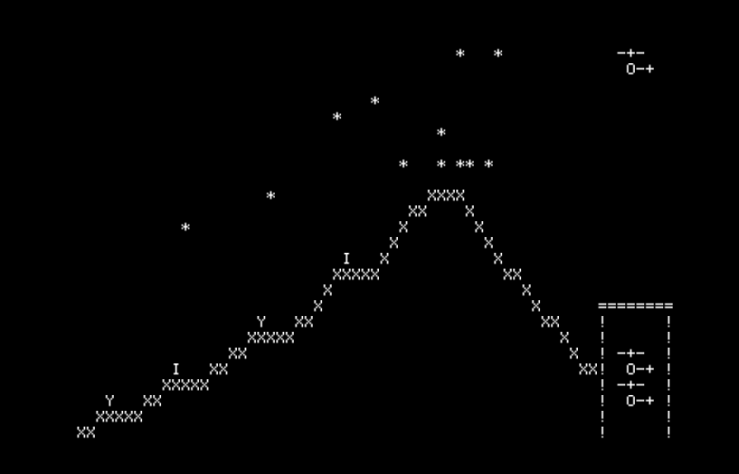

# Volcano (ВУЛКАН) — RK86 Game Disassembly

> **Disclaimer:** This project is for educational and archival purposes only. All rights to the original game implementation belong to their respective authors. No copyright infringement is intended. 

The accuracy of the disassembly is verified in CI by assembling the annotated source and comparing the output byte-for-byte against the original "golden" binary.

Annotated Intel 8080 disassembly of "Volcano", a rescue helicopter game for the Радио-86РК (Radio-86RK) computer.

- [volcano.asm](volcano.asm) — annotated source
- [volcano.lst](volcano.lst) — assembler listing with addresses and symbol table

- [VOLCANO.GAM](VOLCANO.GAM) — the tape binary without the E6 header and trailer
- [tape/VOLCANO.GAM](tape/VOLCANO.GAM) — tape version of the binary with the E6 header and trailer

```console
(C) 1987 BONY
390008 Рязань, Братиславская 27
Радиотехнический институт, СКБ "DESIGN"
```





## The Game

A volcano is erupting. Four people are stranded on ledges along its slopes. You pilot a helicopter to rescue them — pick each person up, fly them back to the station, and drop them off before the rising lava reaches them.

## Gameplay mechanics

- **Helicopter**: 2-line sprite (rotor `-+-` and body `O-+` or `+-O`). Moves in 4 directions via configurable keys (default: cursor codes). Cockpit `O` is the collision point.
- **Pickup**: hover so cockpit `O` is directly above a person `I`/`Y`. The person attaches below as a hanging `I` character.
- **Drop-off**: fly over the station roof `=`. The person is deposited inside.
- **Carry timer**: a person can only hang for 0x28 (40) game ticks. In the last 10 ticks, they swing (`J`/`L` alternating). At zero, they fall and die.
- **Lava**: advances one row every 10 game ticks. Each step fills a row with `+` chars. If lava reaches a person's ledge, they die.
- **Stones/ash**: 20 particles (`*`) launched from the volcano peak with random trajectories. Parabolic arcs via 16-bit fixed-point physics with gravity. Hitting the helicopter destroys it.
- **Bullets**: pressing fire shoots `-` horizontally from the cockpit. Bullets destroy stones (replacing `*` with `+`). Bullets also kill people if they hit `I`/`Y`.
- **Souls**: when a person dies (lava, falling, bullet), a soul `()` appears and drifts around. Souls are partially attracted toward the helicopter (1/3 vertical seek, 1/2 horizontal seek). Touching a soul destroys the helicopter.
- **Lives**: 3 helicopters total. Crash triggers a fast explosion (32-step expanding ring of `.` dots). Spare helicopters are visible inside the station.
- **Scoring**: the high score table tracks `saved_people` (higher is better) and `used_helicopters` (lower is better). Top 5 scores are stored in RAM with player names (persisted as long as the game stays loaded).

## Architecture

### Memory layout

| Address       | Contents |
|---------------|----------|
| `0x0000-0x1FFF` | ROM monitor (also used as entropy source by PRNG) |
| `0x0100-0x0FFF` | Game code and data (3840 bytes) |
| `0x0F00-0x0FFF` | Game variables, high score table, runtime buffers |
| `0x117F-0x17BF` | Screen buffer (64x25 = 1600 bytes, mirrors video RAM) |

The stack pointer is set to `0x117F` (top of screen buffer), growing downward into the variable area.

### Screen buffer addressing

The RK86 uses an interleaved bank layout for its 64-column x 25-row display. The `screen_area_address` routine (offset `05A0h`) converts (column, row) to a buffer address:

```python
address = screen_area + (col >> 2) * 256 + (col & 3) * 64 + row
```

Two `RRC` instructions rotate the column value to split it into bank (high 6 bits) and offset (low 2 bits shifted to bits 6-7). The game maintains a shadow buffer at `0x117F` that mirrors the screen contents, enabling collision detection by reading characters from the buffer.

### Helicopter sprite rendering

The helicopter is drawn/erased via null-terminated strings containing VT52 cursor escape codes:

- `0x19` = cursor up
- `0x1A` = cursor down  
- `0x08` = backspace

This allows drawing the 2-line sprite (body row + rotor row) with a single `print_str` call, without explicit cursor repositioning. Four strings handle the combinations of left/right facing and draw/erase.

### Stone/ash physics

Each of the 20 stones is an 8-byte structure with 16-bit fixed-point (8.8) positions and velocities:

| Byte | Field | Description |
|------|-------|-------------|
| 0 | x_vel_lo | X velocity fraction (constant) |
| 1 | x_pos_lo | X position fraction |
| 2 | x_vel_hi | X velocity integer (signed, constant) |
| 3 | x_pos_hi | X position = column (0-63) |
| 4 | y_vel_lo | Y velocity fraction (**+1 each frame = gravity**) |
| 5 | y_vel_hi | Y velocity integer (starts -1 = upward) |
| 6 | y_pos_lo | Y position fraction |
| 7 | y_pos_hi | Y position = row (0-24) |

Each frame: `x_pos += x_vel` (constant drift), `y_vel += 1` (gravity), `y_pos += y_vel` (acceleration). This produces parabolic arcs — stones launch upward from the crater peak (columns 37-40, row 8) and curve back down. Stones that leave the screen are re-initialized with new random trajectories.

### PRNG

The random number generator (`random`, offset `05F7h`) uses:

1. A 16-bit seed as a pointer into ROM (addresses `0x0000-0x1FFF`) to read a byte for entropy
2. An accumulator that mixes in the ROM byte and the requested range
3. Rejection sampling with a narrowing bitmask to produce unbiased results in `[0..max]`

### Lava progression

The `lava_levels` table (offset `0D8Fh`) has 16 entries of 5 bytes each:

```python
count, row, column, human_row, human_col
```

Each lava step draws `count` copies of `+` starting at `(row, column)`. If `human_row != 0`, the routine checks whether a person is still alive at that position and kills them if so.

### Collision detection

The game uses character-based collision. Before moving the helicopter, it checks 3 consecutive bytes in the screen buffer (for the rotor line and body line). If any cell is not a space (`0x20`), the move is blocked or triggers a crash. Special cases:

- `=` (station roof) — blocks movement, or triggers person deposit if carrying
- `I`/`Y` (person) — triggers pickup if directly below cockpit
- `O` (own cockpit, during bullet processing) — skip over

### Packed landscape

The initial screen layout is RLE-compressed (offset `0D9Fh`):

- `N, char` — repeat `char` N times
- `N, 0` — end of row (advance to next screen line)
- `0xFF, ...0` — literal string until null terminator
- `0` — end of data

### Volcano title bitmap

The title screen displays "VOLCANO" in large pixel-art letters. The data is 7 character bytes (`V`, `O`, `L`, `C`, `A`, `N`, `O`) followed by a 7x7 bitmap. Each bit in the bitmap selects whether to print the corresponding column's letter or a space:

```console
V.....V. .OOOOO.. L....... .CCCCC.. ......A. N.....N. .OOOOO..
V....V.. O.....O. L....... C.....C. .....AA. NN....N. O.....O.
V...V... O.....O. L....... C....... ....A.A. N.N...N. O.....O.
V..V.... O.....O. L....... C....... ...A..A. N..N..N. O.....O.
V.V..... O.....O. L....... C....... ..A...A. N...N.N. O.....O.
VV...... O.....O. L....... C.....C. .AAAAAA. N....NN. O.....O.
V....... .OOOOO.. LLLLLLL. .CCCCC.. A.....A. N.....N. .OOOOO..
```

## Build

Requires [Bun](https://bun.sh/) and [Just](https://github.com/casey/just).

```bash
just ci       # assemble + verify against golden binary
```

The assembler is [asm8080](https://www.npmjs.com/package/asm8080). The golden binary `VOLCANO.GAM` is the original game dump. Every assembled output must match it byte-for-byte.

## Related

- A Python reimplementation with nearly identical gameplay is at [python/volcano.py](./python/volcano.py). Run it with `uv run python python/volcano.py`
- The [RK86 ROM monitor](https://github.com/begoon/rk86-monitor/blob/main/monitor.asm) provides keyboard input, screen output, and cursor positioning via subroutines.

## Online

Play VOLCANO [online](https://rk86.ru/beta/index.html?file=RESCUE.GAM).

Original game for BBC Micro - https://bbcmicro.co.uk/game.php?id=143
